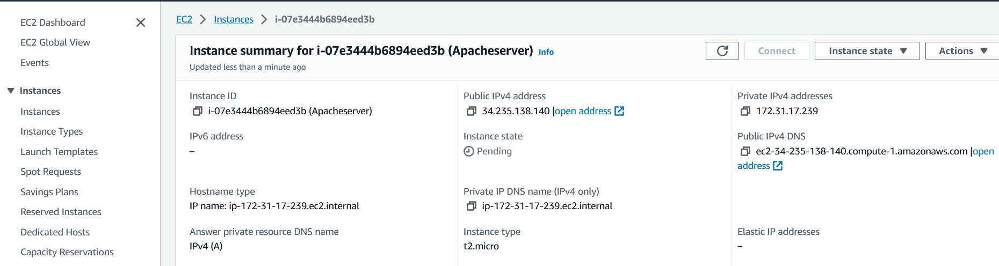
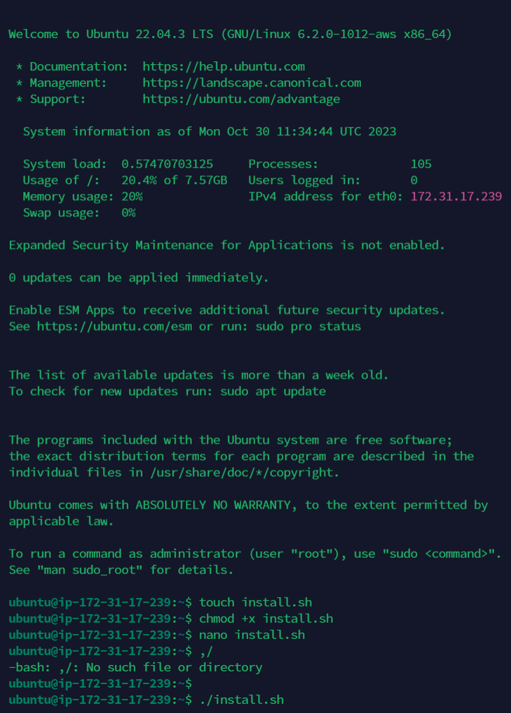
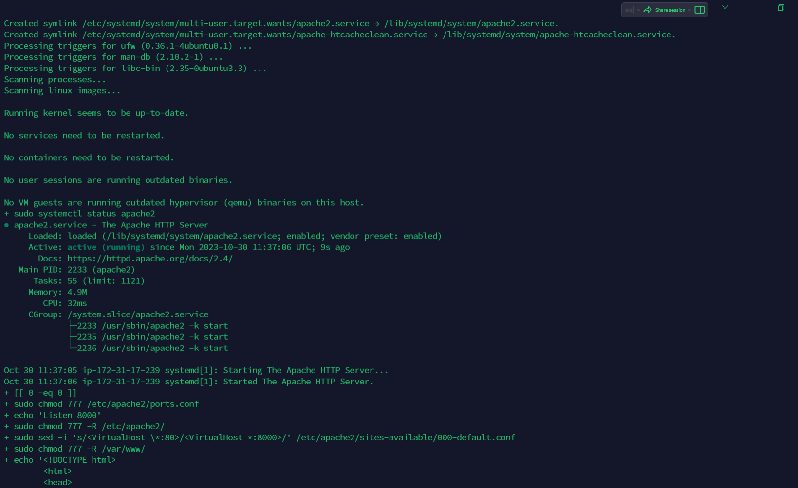
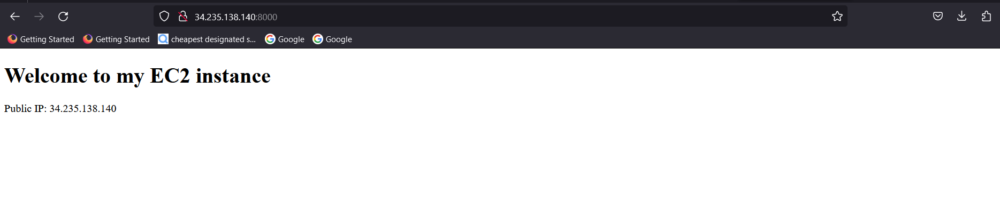
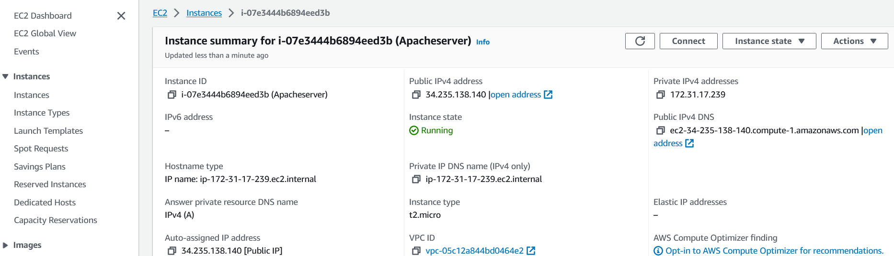
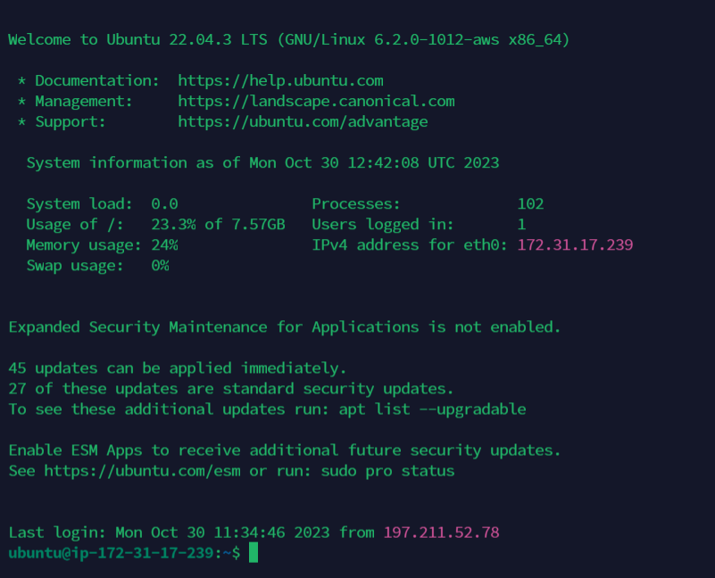
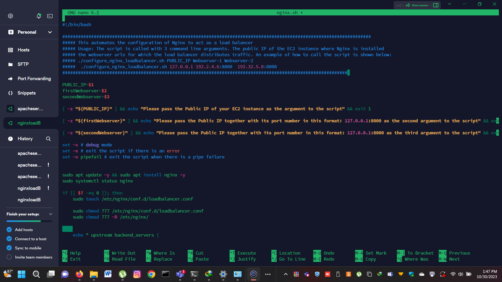
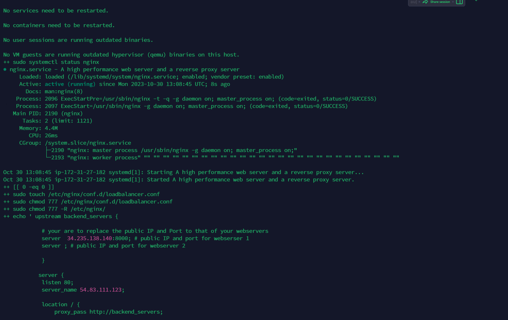
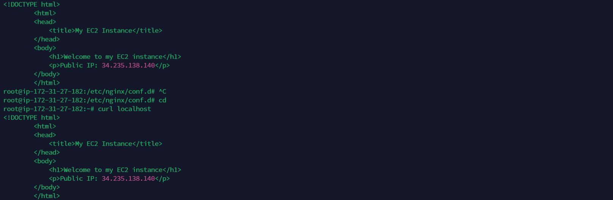
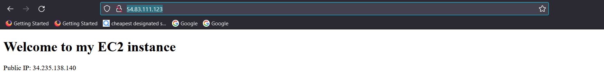

**Automating LoadBalancer Configuration With Shell Scripting**

Deploying and configuring my webserver

-  I created an Ubuntu instance in aws called apacheserver 

-  Using Termius, I SSH into the my ubuntu instance using the public ip address.

-  I created a file called install.sh, which is going to be the scripts to automate apache2 installtion and allowing it listing on port 8000

   

   -  I did chmod +x on my script (Install.sh) to make the acript executable.

   -  I ran the script like this  ./install.shh 34.235.138.140 and it was successful.

     

     -  http://mypublicIp

     

**Deployment Of Nginx As A Loadbalancer**

-  I created another ubuntu instance in aws named nginxLoadB

-  I SSh into my instance using the public ip address in termius

-  I created a file called nginx.sh
-  I changed the mode using chmod +x to make the scrip executable. 

-  With nano command, i edited nginx.sh script and added the automation code as shown

- I ran the script like this ./nginx.sh 54.83.111.123 34.235.138.140:8000 and it suceessful.

-  

- Because i do not have the second webserver, I edited the automation code to remove the line.

-  I also edited the default nginx configution file and changed the port to port 8000 to prevent it interfering with the loadbalancing configuration in conf.d folder which will run on port 80

- using curl Localhost 

    

-  Using the Url (http://54.83.111.123/)

**Project completed** 

